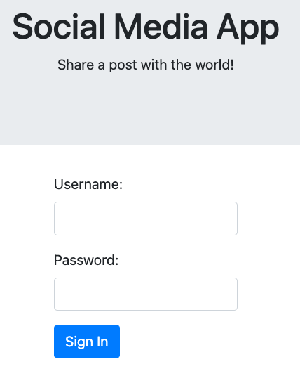

# <p style="text-align: center;"> SQL Injection Mustache Style: Part 1 </p> <!-- omit in toc -->


<h1>TEST</h1>



<center>


</center>


- [Introduction to Injection](#introduction-to-injection)
- [SQL Syntax](#sql-syntax)
- [URL Encoding](#url-encoding)
- [Reconnaissance](#reconnaissance)
- [Weaponization and Delivery](#weaponization-and-delivery)
- [Exploitation](#exploitation)
- [Defense](#defense)
  - [Defense - Input Validation](#defense---input-validation)
  - [Defense - Least Privilege](#defense---least-privilege)
  - [Defense: Parameterized Queries](#defense-parameterized-queries)
- [Defense Code Examples](#defense-code-examples)
  - [Clojure](#clojure)
  - [Go](#go)
  - [Java](#java)
  - [.Net](#net)
  - [JavaScript](#javascript)
  - [PHP](#php)
  - [Python](#python)
  - [Ruby](#ruby)
  - [Scala](#scala)
  - [TypeScript](#typescript)

<center>

---
<br><center>

## Introduction to Injection
</center>
</center>
Before diving into the hands-on portion of this lesson we will start with some background information on Injection, SQL Injection, and SQL Syntax. Then we will start the hands-on exercises with Reconnaissance.

An injection attack allows attackers to inject code into a program or query. Injection attacks come in many forms and we will explore SQL Injection in this lesson.

You will be using a browser and a web proxy. The proxy has the ability to stop all HTTP requests to the server so that they can be analyzed and modified before forwarding them to the server. There are many proxies that can be downloaded and used for security testing, but Burp Suite is one of the most heavily used. Our proxy works the same as Burp Suite with simpler functionality for this intro lesson.

If you need a hint and see the Show Hint button, you can click it for additional information.

SQL injection (SQLi) is where an attacker can inject SQL commands into a SQL statement. For example, look at the following code:

```sql
query = "SELECT * FROM users WHERE name='" + user + "' AND password='" + password + "'";
```

Both the name and password variables can be entered by an attacker to alter the intent of the SQL query. For example, if name = jane and password = x' OR '1'='1 then the WHERE clause would evaluate to true. The SQL query would look like this:

```sql
SELECT * FROM users WHERE name='jane' AND password='x' OR '1'='1';
```

This will always evaluate to true because '1'='1' so it will output the entire user table because the WHERE clause is always true. If a check is made to make sure that the query returns any data before logging a user in then you would be authenticated.

---
<br><center>

## SQL Syntax
</center>
It is important to note that syntax for different SQL databases varies, so trying different syntax to test for SQL injection vulnerabilities is important. There are many SQL Injection cheat sheets on the internet that can be used to test for SQL injection attacks. For example, a technique for ignoring everything after what you enter into the variable is using a comment. For the different versions of SQL the comment symbol varies:

```sql
MySQL, MSSQL, Oracle, PostgreSQL, SQLite:

`' OR '1'='1' -- ' OR '1'='1' /*`
```
```sql
MySQL:

- `' OR '1'='1' #`
```
```sql
Access (using null characters):

- `' OR '1'='1' %00 ' OR '1'='1' %16`
```

You will come across characters that are URL encoded. Instead of using the character itself an encoding is used. This is common with web applications sending spaces and non-alphanumeric characters. We will go into URL encoding more in depth in another lesson but some basics are below.

---
<br><center>

---
<br><center>

## URL Encoding 
</center>
</center>

starts with a percent symbol "%" and is then followed by a hexadecimal character. It is not important to know details about hexadecimal or URL encoding at this time. Some of the important encodings for reference:

URL ENCODING	CHARACTER
%20	          space
%22	          "
%27	          '
%28	          (
%29	          )
%2C         	,

You can always use a search engine to look these up at any time. The proxy will show you URL encoded data, however, you do not need to enter URL encoded information into the proxy, feel free to use unencoded text.

Where do you look for SQL injection vulnerabilities? Any web application input that would do a database lookup or insert data into a database. The data may be entered as part of a URL, part of an input field, or by modifying an API call

---
<br><center>

## Reconnaissance
</center>

In this exercise, there is a social media app login screen in the browser sandbox. The goal is to try to get into Alice's account (username: alice). A SQL injection attack may be one way to do this.

First, test if a SQL injection vulnerability exists by entering a SQL special character for the password, such as a single quote (') and see what happens.

We are looking for a server error or something similar to test to see if there may be an issue with the site's security and the underlying software.

Note: Don't worry if you see an internal server error.

Enter into the browser sandbox the username: alice and the password:

alice'
(including the single quote). Keep in mind, if you have the Intercept Requests enabled, you will have to click Submit in the Proxy (or just disable Intercept Requests for now).

What happened?

If you received an Internal Server Error, this is a tell tale sign that there may be a SQL injection vulnerability. Click the Home button in the browser sandbox to return to the login screen.


```
Internal Server Error
The server encountered an internal error and was unable to complete your request. Either the server is overloaded or there is an error in the application.
```


---
<br><center>

## Weaponization and Delivery
</center>
Now, try to break into Alice's account (username = alice). How can you make it so the SQL statement will always evaluate to true?

If the Proxy is enabled you will have to click Submit once when the POST request is made and a second time when a GET request is made to request the /posts page upon successful exploitation.

A solution is on the next page. Try to get into the account before clicking next.

Solution: 
`' OR '1'='1' -- ' OR '1'='1' /*`


SQL Injection Hint
Try entering something into the password field that will always make the WHERE clause evaluate as true as well, like:

x' OR true OR 'x
The last part of this statement (OR 'x) is needed or you will have a missing quote in the statement. If you try this payload:

x' OR true
your WHERE clause will look like this (with a strangling quote at the end), giving you a 500 Internal Server Error:

WHERE password = 'x' OR true ';
So you include the 'x to make it a valid SQL Statement:

WHERE password = 'x' OR true OR 'x';
To see another valid payload that will always evaluate to true, click Next.

SQL Injection Hint
Try entering this in the proxy for the password:

x' OR '1' = '1
'1' = '1' will always be true, so it doesn't matter what the rest of the SQL statement says for the password.

The WHERE clause in the SQL will now look something like this:

WHERE password = 'x' OR '1' = '1'

---
<br><center>

## Exploitation
</center>
There are many possible solutions to enter to get logged in. If you were not able to figure it out, try entering:

x' OR '1' = '1
for the password.

Once you have gotten into the account you will see a place to post to your feed. A lot of times when you find one problem on a website it is a systemic problem. In the SQL Injection Part 2 lesson we will see if we can find another flaw in this feature.


---
<br><center>

## Defense
</center>

SQL Injection occurs because an attacker can manipulate and change a SQL query executed by the target application. The input is interpreted as a part of the SQL command, and not as a simple string -as it should be.

---
<br><center>

### Defense - Input Validation
</center>

Prevention of SQL Injection vulnerabilities, as for other vulnerabilities, starts with input validation. This means identifying all inputs and determining what kind of data users should be allowed to send. For instance, if your application asks users for their age, ensure the data input is actually a number and in the range of something reasonable such as 5-125.

---
<br><center>

### Defense - Least Privilege
</center>

Also, make sure you always enforce least privilege. This is a security principle that states only minimal privileges should be provided to a user/application/system to perform their duties. Simply put, never use the default ‘root’ user. For instance, if your web application uses a database to store/retrieve information, then your database user should have privileges to perform only basic tasks such as SELECT, INSERT, DELETE, UPDATE and EXECUTE. Everything else should be disabled. So even if an attacker manages to circumvent your prevention mechanisms, she will not be able to get complete access to your server.

All these are general security best practices. While they help, relying only on them alone may not prevent SQL Injection vulnerabilities. The best method to mitigate SQL injection is: parametrized query or prepared statements.

Also, make sure that the original functionality still works. Check that these credentials still function: username: alice, password: monkey1.


---
<br><center>

### Defense: Parameterized Queries
</center>

A parameterized query (also known as a prepared statement with variable binding) is a SQL query that contains a placeholder instead of the actual values provided by the user. 

When executed, a parameterized query is first pre-compiled, so the user input data is always interpreted as a simple string and not as part of the statement. 

This enables better performance and safe execution of the SQL command since data won't be "executed". If you want to learn more about different SQL Injection prevention methods and how prepared statements work, check out our blog post.

---
<br><center>

## Defense Code Examples
</center>


### Clojure
```Clojure
(def res (sql/query connection
     ["SELECT * FROM foo WHERE id=? " bar]))
```
### Go
```Go
rows, err := db.Query("SELECT * FROM foo WHERE bar = ? AND baz = ?;", param1, param2)
```
### Java
```Java
PreparedStatement stmt = con.prepareStatement("SELECT * FROM foo WHERE bar=? AND baz=?");
stmt.setString(1, param1);
stmt.setString(2, param2);

ResultSet rs = stmt.executeQuery();
```
### .Net
```.NET
string sql = "INSERT INTO foo VALUES(NULL, @number, @text)";
MySqlCommand cmd = new MySqlCommand(sql, conn);
cmd.Parameters.Add("@number", i);
cmd.Parameters.Add("@text", "A string value");
cmd.Prepare();
MySqlDataReader rdr = cmd.ExecuteReader();
```
### JavaScript

```JavaScript
connection.query(
    "SELECT * FROM foo WHERE bar=? AND baz=?",
    [param1, param2],
    function (error, results) {
    }
);
```
### PHP
```PHP
$stmt = $dbh->prepare("INSERT INTO foo (name, value) VALUES (:name, :value)");
$stmt->bindParam(':name', $name);
$stmt->bindParam(':value', $value);
$name = 'one';
$value = 1;
$stmt->execute();
```
### Python
```Python
c.execute("SELECT * FROM foo WHERE bar = %s AND baz = %s", (param1, param2))
```

### Ruby
```Ruby
ps = client.prepare("SELECT * FROM foo WHERE bar = ? AND baz = ?")
results = ps.execute(bar, baz)
```

### Scala
```Scala
val stmt = con.prepareStatement("SELECT * FROM foo WHERE bar=? AND baz=?");
stmt.setString(1, param1);
stmt.setString(2, param2);
val rs: ResultSet = stmt.executeQuery()
rs.next()
```
### TypeScript
```TypeScript
connection.query(
  "SELECT * FROM foo WHERE bar=? AND baz=?",
  [param1, param2],
  (error: MysqlError, results: any): void => {
  }
);

```
If prepared statements and stored procedures are not available use an allowlist as a last resort. Sanitizing data can be used to remove special characters or statements. This is database specific and is often implemented incorrectly so it should not be relied upon.

```python
import os
import pymysql


def login(username, password):
    conn = pymysql.connect(host='db', port=3306, user='root', passwd='letmein', db='SocialMediaApp')
    cursor = conn.cursor()

   #query = "SELECT * FROM users WHERE username = '" + username + "' AND password = '"+ password + "';"
 
    cursor.execute("SELECT * FROM users WHERE username = %s AND password = %s;", (username, password))
    data = cursor.fetchall()

    conn.commit()
    cursor.close()
    conn.close()

    if not data:
        return False

    return True


```

```javascript
const mysql = require('mysql');

exports.login = function(username, password) {
  return new Promise((resolve, reject) => {
      const conn = mysql.createConnection({
        host     : 'db',
        user     : 'root',
        password : 'letmein',
        database : 'SocialMediaApp'
      });
      conn.connect();

      //const statement = "SELECT * FROM users WHERE username ='" + username + "' AND password='"+ password + "';"
      const statement = "SELECT * FROM users WHERE username =? AND password=?;"


      conn.query(statement,[username, password], function (error, results, fields) {
          if (error) reject();
          if (results.length === 0) {
              resolve(false);
          }
          resolve(true);
      });

      conn.end();
  });
}

```


